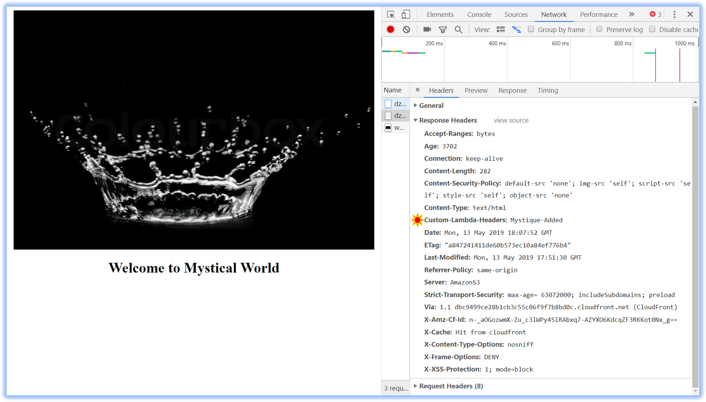

# S3 Static Site - CloudFront with Lambda@Edge

Lets say, we have a S3 static site with Cloudfront in the front for caching. We want to use Lambda@Edge to change or update custom headers. You can use the same pattern to rewrite URLs/redirect traffic, A/B Testing etc.,


#### Follow this article in [Youtube](https://youtube.com/c/valaxytechnologies)

0. ## Prerequisites

    - AWS CLI pre-configured

1. ## Clone the repository

   ```bash
   git clone https://github.com/miztiik/cloudfront-lambda-at-edge.git
   ```

1. ## Customize the deployment

    In the `cloudfront-lambda-at-edge` directory, Edit the `./helper_scripts/deploy.sh` to update your environment variables.

    **You will have to create an S3 bucket in your account and update the `BUCKET_NAME` in the below section**
  
    ```bash
    AWS_PROFILE="default"
    AWS_REGION="us-east-1"
    BUCKET_NAME="sam-templates-011" # bucket must exist in the SAME region the deployment is taking place
    SERVICE_NAME="cloudfront-lambda-at-edge"
    TEMPLATE_NAME="${SERVICE_NAME}.yaml" # The CF Template should be the same name, If not update it.
    STACK_NAME="${SERVICE_NAME}-001"
    OUTPUT_DIR="./outputs/"
    PACKAGED_OUTPUT_TEMPLATE="${OUTPUT_DIR}${STACK_NAME}-packaged-template.yaml"
    ```

    Save the file.

1. ## Deployment

    We will use the `deploy.sh` in the `helper_scripts` directory to deploy our [AWS SAM](https://github.com/awslabs/serverless-application-model) template

    ```bash
    chmod +x ./helper_scripts/deploy.sh
    ./helper_scripts/deploy.sh
    ```
  
1. ## Upload the HTML files

    Copy all the files in the `html` directory to the root of your S3 Bucket(`cloudfront-lambda-at-edge-001-hostbucket`) created by the stack.

1. ## Verify the deployment

    Open the cloudfront url in the browser and check out the developer settings(F12 in chrome). As shown in the screenshot below, there will be a header `Custom-Lambda-Headers: Mystique-Added`, You can add any header for security.

    

1. ## Troubleshooting: Lambda@Edge Logs

    The logs are generated & stored at the aws region nearest to the user location. To find out which location has logs,

    ```bash
      FUNCTION_NAME="cf-edge-test"
      for region in $(aws --output text  ec2 describe-regions | cut -f 3)
      do
          for loggroup in $(aws --output text  logs describe-log-groups --log-group-name "/aws/lambda/us-east-1.${FUNCTION_NAME}" --region ${region} --query 'logGroups[].logGroupName')
          do
              echo ${region} ${loggroup}
          done
      done
    ```

### CleanUp

  If you want to destroy all the resources created by the stack, First empty the `S3 Bucket` of all the files that had been copied over. Execute the below command to delete the stack, or _you can delete the stack from console as well_

  ```bash
  # Delete the CF Stack
  ./helper_scripts/deploy.sh nuke

  # Delete the Lambda Log Groups, since these are edge functions, the logs can be in any of the CF distribution regions
  lg_name="/aws/lambda/us-east-1.cloudfront-lambda-at-edge-001-Mystique"
  for region in $(aws --output text  ec2 describe-regions | cut -f 3)
  do  
      echo ${region}
      aws logs delete-log-group --log-group-name "${lg_name}" --region ${region}
  done
  ```

### Contact Us

You can reach out to us to get more details through [here](https://youtube.com/c/valaxytechnologies/about).